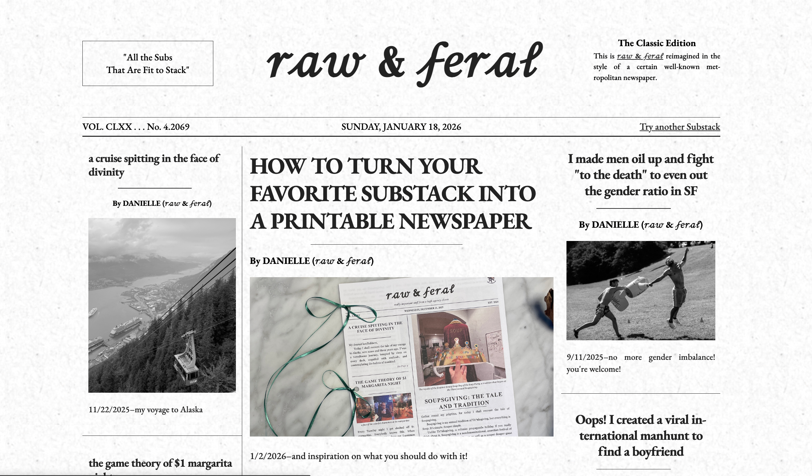

# Substack Classic

View any Substack newsletter in the style of a classic newspaper.

This is built with [unim.press](https://github.com/thesephist/unim.press) as a static, single page application, and uses the public Substack RSS feeds via [rss2json](https://rss2json.com/).

